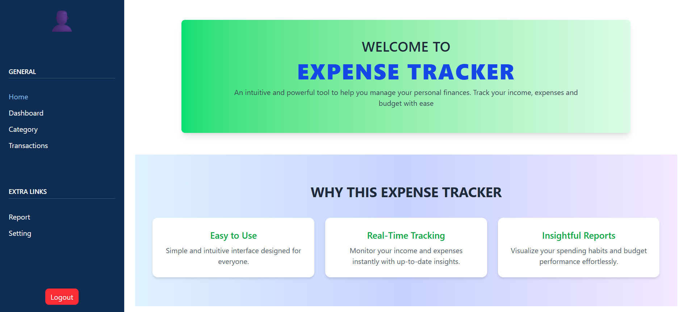
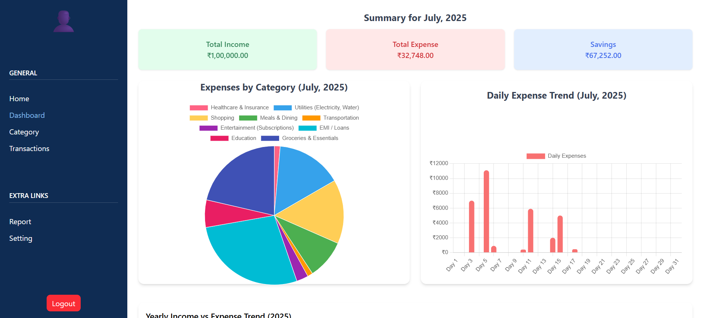
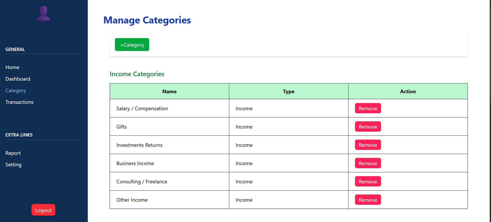
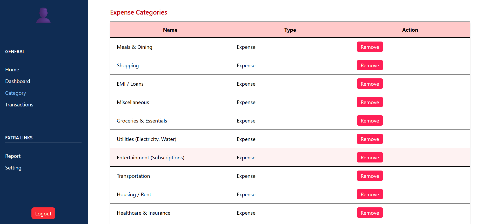
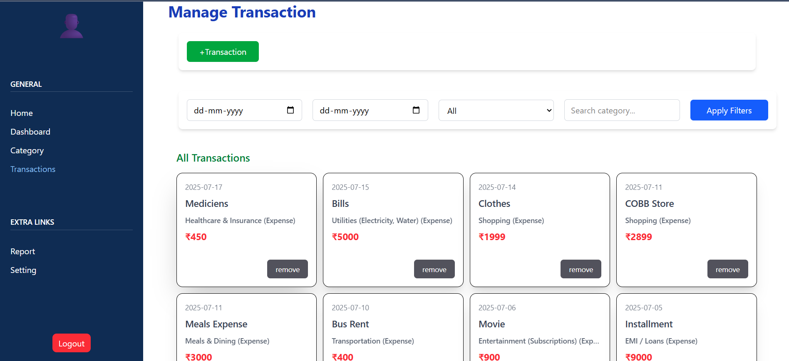
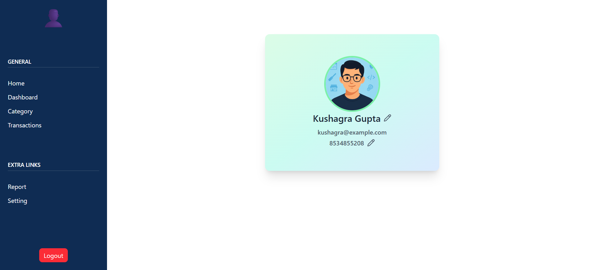

#  Expense Tracker App (MERN)

A full-stack MERN application for tracking income and expenses with intuitive charts, user authentication, category-wise breakdowns, and a responsive dashboard UI.

---

##  Features

- User Registration and Login (JWT-based)
- Clean and responsive dashboard
- Pie and Bar Charts (using Chart.js)
- Category Management:
  - Income & Expense categories
- Transaction Management:
  - Add/Delete transactions
  - Linked with category and user
- User Profile & Logout
- Sidebar-based navigation
- MongoDB Atlas-based data with per-user isolation

---

##  Project Structure

/expense-tracker-frontend → React Frontend
/expense-tracker-backend → Node.js + Express Backend
/screenshots → App UI Previews


---

## Technologies Used

- **Frontend:** React.js, Chart.js, TailwindCSS
- **Backend:** Node.js, Express.js
- **Database:** MongoDB Atlas, Mongoose
- **Authentication:** JWT + bcrypt
- **State Management:** React Hooks (useState, useEffect)
- **Data Visualization:** Chart.js (Pie + Bar)

---

##  Setup Instructions

### 1. Clone the Repository
```bash
git clone https://github.com/TheKushagraPerspective/expense-tracker.git
cd expense-tracker
```


2. Install Dependencies

```bash
Backend
cd expense-tracker-backend
npm install
```

```bash
Frontend
cd expense-tracker-frontend
npm install
```


3. Configure Environment Variables

```bash
In /expense-tracker-backend/, create a .env file:
PORT=5000
MONGO_URI=your_mongodb_atlas_connection_string
JWT_SECRET=your_jwt_secret_key
```


4. Run the App

```bash
Start Backend
cd expense-tracker-backend
nodemon index.js  # or: node index.js
```

```bash
Start Frontend
cd expense-tracker-frontend
npm run dev
```

---


Application Architecture & Flow

➤ Authentication
    User signs up or logs in.
    JWT token is stored in localStorage.
    Token is verified on each protected API request.
    User ID is extracted and used to filter data.

➤ Data Flow

Categories
    Users can create separate income and expense categories.
    Each category is stored against the user’s ID.

Transactions
    Users add transactions with amount, type, category, note, and date.
    Transactions are populated with category details using .populate() in Mongoose.

Dashboard
    Summarizes:
    Total income and expense
    Balance
    Pie Chart (category-wise)
    Bar Chart (monthly summary)

Sidebar Navigation
    pages: Home, Dashboard, Categories, Transactions, Profile

Profile
    Displays user email & ID.
    Logout button clears token and redirects to login.


---


Folder Breakdown
/expense-tracker-frontend
├── /components       → Sidebar, Chart Components, Cards
├── /pages            → Home, Dashboard, Categories, Transactions, Profile
├── /styles           → CSS files
├── /utils            → API helper functions, token handler
└── main.jsx          → React entry point

/expense-tracker-backend
├── /controllers      → Logic for auth, categories, transactions
├── /models           → Mongoose models: User, Category, Transaction
├── /routes           → API routes
└── index.js          → Entry point for Express app

---


##  Screenshots of Our Expense Tracker Application

###  Home


###  Dashboard


###  Category Page



###  Transaction Page


###  Profile Page



👤 Author
Kushagra Varshney
B.Tech CSE, Lovely Professional University
MERN Stack Developer